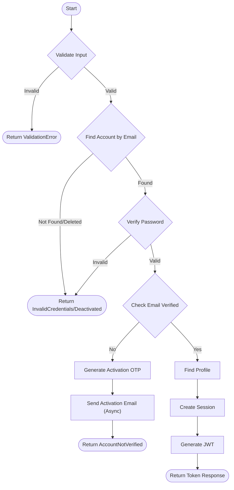

# Login using credential

Authenticates a user by verifying their email and password, returning a JWT token pair (access and refresh) for session management.

## Description

This endpoint verifies the credentials (email and password). If valid and the account is active/verified, it creates a session and returns a JWT access token and a refresh token.

## Rules

-   **Account Verification**: The account must be active and verified. If credentials are correct but the account is not verified, a `403 Forbidden` status is returned, and a new activation email is automatically sent.
-   **Account Status**: If the account is deactivated, a `406 Not Acceptable` status is returned.
-   **Credentials**: The email and password must match an existing account. If not, a `401 Unauthorized` status is returned.
-   **Session Creation**: On success, a new session is created and a JWT access token and refresh token are returned.

## Request

- **Method:** `POST`
- **Path:** `/auth/login/credential`
- **Body:** `application/json`

| Field    | Type   | Required | Description              |
|----------|--------|----------|--------------------------|
| email    | string | Yes      | The user's email address |
| password | string | Yes      | The user's password      |

### Example

```json
{
  "email": "user@example.com",
  "password": "Test@123"
}
```

## Workflow



## Success Case

**Condition:** valid email and password, account is active and verified.

- **HTTP Status:** `200 OK`
- **Response Body:**

```json
{
  "token_type": "Bearer",
  "access_token": "eyJhbGciOiJIUzI1NiIs...",
  "refresh_token": "eyJhbGciOiJIUzI1NiIs...",
  "expires_in": 900
}
```

## Error Cases

### Unauthorized

**Condition:** The email or password does not match any existing account.

- **HTTP Status:** `401 Unauthorized`
- **Response Body:**
  ```json
  {
    "name": "AccountInvalidCredentials",
    "message": "Invalid email or password"
  }
  ```

### Account Not Verified

**Condition:** The credentials are correct, but the account has not been verified yet. An activation email is sent automatically.

- **HTTP Status:** `403 Forbidden`
- **Response Body:**
  ```json
  {
    "name": "AccountNotVerified",
    "message": "Account validation is required"
  }
  ```

### Account Deactivated

**Condition:** The account has been deactivated manually.

- **HTTP Status:** `406 Not Acceptable`
- **Response Body:**
  ```json
  {
    "name": "AccountDeactivated",
    "message": "Account is deactivated"
  }
  ```

### Invalid Data

**Condition:** Invalid format for email or missing password.

- **HTTP Status:** `422 Unprocessable Entity`
- **Response Body:** Validation error details.
