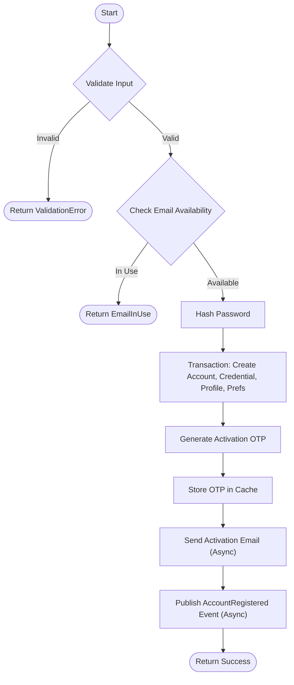

# Register Account

Registers a new user account using email and password.

## Description

This endpoint allows a user to register a new account. It validates the email and password complexity, checks if the email is already in use, creates the account in an unverified state, and triggers an activation email.

## Rules

- The endpoint must be accessed via a `POST` request.
- **Email**: Must be a valid email format.
- **Password**:
    - Length between 8 and 50 characters.
    - Must contain at least one uppercase letter.
    - Must contain at least one lowercase letter.
    - Must contain at least one number.
    - Must contain at least one special character.
- If the email is already associated with an account (even soft-deleted), a `409 Conflict` is returned.
- Upon success, an activation email is sent to the registered email address.

## Request

- **Method:** `POST`
- **Path:** `/auth/register`
- **Body:** `application/json`

| Field    | Type   | Required | Description                     |
|----------|--------|----------|---------------------------------|
| email    | string | Yes      | The user's email address.       |
| password | string | Yes      | The user's password.            |

### Example

```json
{
  "email": "john.doe@email.com",
  "password": "Test@123"
}
```

## Workflow



## Success Case

**Condition:** valid email and password, email not in use.

- **HTTP Status:** `201 Created`
- **Response Body:** Empty

## Error Cases

### Email Already In Use

**Condition:** The provided email is already registered.

- **HTTP Status:** `409 Conflict`
- **Response Body:**
  ```json
  {
    "name": "EmailInUse",
    "message": "The provided email is already associated with an account."
  }
  ```

### Invalid Data

**Condition:** Email format invalid or password complexity requirements not met.

- **HTTP Status:** `422 Unprocessable Entity` (or `400 Bad Request` depending on global error handling)
- **Response Body:** Validation error details.
