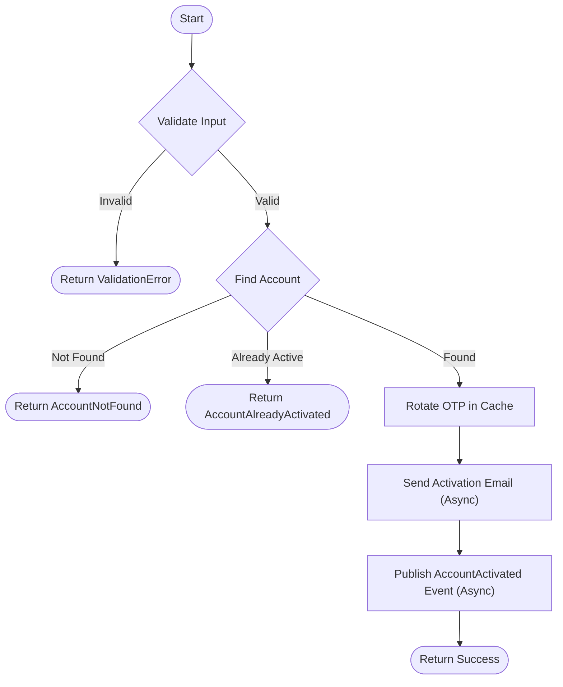

# Resend Activation Code

Resends the activation code to the user's email address.

## Description

This endpoint allows a user to request a new activation code if the previous one expired or was not received. It verifies if the account exists and is not yet activated.

## Rules

- The endpoint must be accessed via a `POST` request.
- **Email**: Must be a valid email format.
- If the email is not found, a `404 Not Found` is returned.
- If the account is already verified, a `409 Conflict` is returned.
- Upon success, a new activation email is sent with a generated OTP.

## Request

- **Method:** `POST`
- **Path:** `/auth/activate`
- **Body:** `application/json`

| Field | Type   | Required | Description               |
|-------|--------|----------|---------------------------|
| email | string | Yes      | The user's email address. |

### Example

```json
{
  "email": "john.doe@email.com"
}
```

## Workflow



## Success Case

**Condition:** valid email, account exists and is not verified.

- **HTTP Status:** `204 No Content`
- **Response Body:** Empty

## Error Cases

### Account Not Found

**Condition:** The provided email is not registered.

- **HTTP Status:** `404 Not Found`
- **Response Body:**
  ```json
  {
    "name": "AccountNotFound",
    "message": "Account not found"
  }
  ```

### Account Already Activated

**Condition:** The account is already verified.

- **HTTP Status:** `409 Conflict`
- **Response Body:**
  ```json
  {
    "name": "AccountAlreadyActivated",
    "message": "Account already activated"
  }
  ```

### Invalid Data

**Condition:** Email format invalid.

- **HTTP Status:** `422 Unprocessable Entity`
- **Response Body:** Validation error details.
