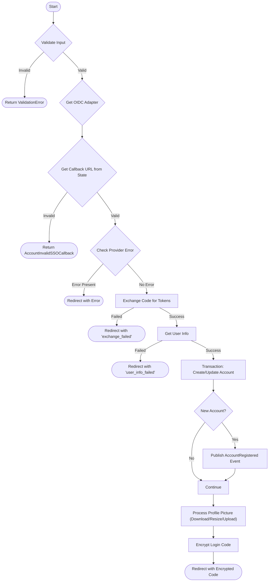

# SSO Provider Callback

This endpoint is the callback target for OIDC providers. It processes the authorization code, retrieves user information, and manages account creation or updates.

## Rules
- **Provider Support**: Must support `google` and `microsoft` (initially).
- **State Validation**: `state` parameter must be a valid base64url encoded JSON containing `callback_url`.
- **Error Handling**: If the provider returns an error or internal validation fails, redirect to `callback_url` with the `error` query param.
- **Account Management**:
  - If the email exists: Check and update `given_name` and `family_name` if they are missing in the local profile.
  - If the email does not exist: Create a new account with email verified, empty password hash, full profile, and default preferences.
- **Profile Picture**:
  - Check if `account/<account_id>/picture.png` exists in storage.
  - If not, download from provider, resize to max 192x192, and upload to storage.
- **Response**: Redirects to `callback_url` with a `code` query parameter.
- **Code Security**: The returned code is encrypted JSON `{account_id, ttl}` valid for 1 minute.

## Request

**Method**: `GET`
**Path**: `/auth/{provider}/callback`

### Parameters

| Name | Location | Type | Description | Required |
| :--- | :--- | :--- | :--- | :--- |
| provider | Path | string | Provider name (`google` or `microsoft`) | Yes |
| code | Query | string | Authorization code from the provider | No (Yes if success) |
| state | Query | string | Base64url encoded state containing callback URL | Yes |
| error | Query | string | Error code from provider | No |
| error_description| Query | string | Error description from provider | No |

## Workflow



## Success Response

**Status**: `307 Temporary Redirect`
**Header**: `Location: <callback_url>?code=<encrypted_code>`

### Encrypted Code Structure (Internal)
```json
{
  "account_id": "uuid",
  "ttl": "2023-10-01T12:00:00Z"
}
```

## Error Response (Provider/Internal Error)

**Status**: `307 Temporary Redirect`
**Header**: `Location: <callback_url>?error=<error_code>`

Examples of error codes: `access_denied`, `invalid_request`, `server_error`.
