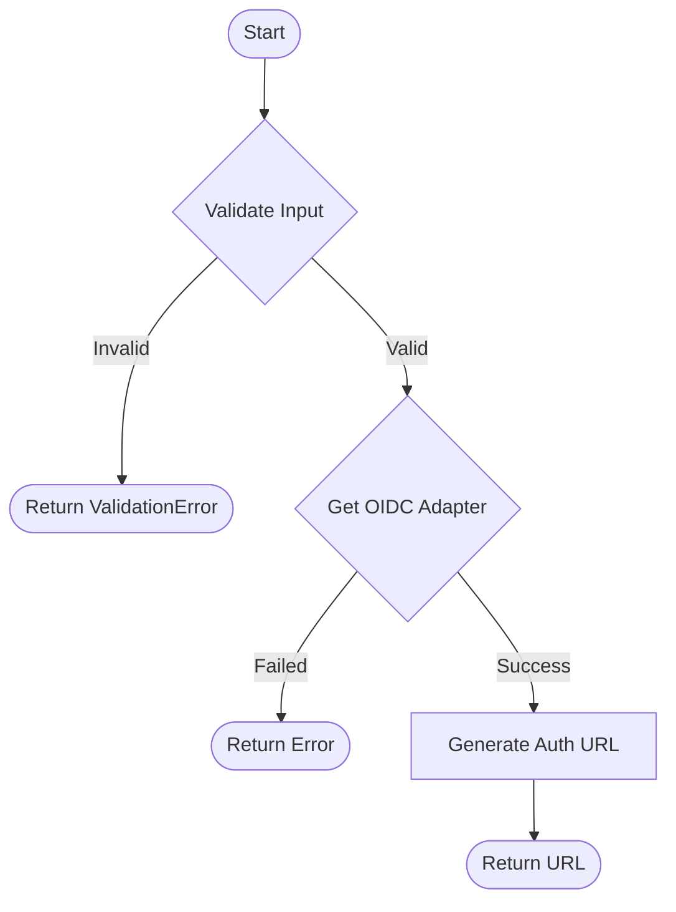

## Rules and Validations

-   The `provider` must be one of: `google`, `microsoft`.
-   The `callback_url` must be a valid URL where the user will be redirected back after authentication.

## Request

**Method**: `GET`
**Path**: `/auth/:provider`

### Parameters

| Name           | In    | Type   | Required | Description                                         |
| :------------- | :---- | :----- | :------- | :-------------------------------------------------- |
| `provider`     | path  | string | Yes      | The SSO provider (`google` or `microsoft`).         |
| `callback_url` | query | string | Yes      | The URL to redirect back to after SSO flow completes. |

## Workflow



## Success Case

**Status**: `302 Found`
**Headers**:
- `Location`: `https://accounts.google.com/o/oauth2/auth?...`

The user is redirected to the SSO provider's authentication page.

## Error Cases

### Invalid Input

**Status**: `400 Bad Request`

```json
{
  "code": "INVALID_INPUT",
  "message": "Validation failed",
  "issues": [
    {
      "field": "callback_url",
      "error": "must be a valid url"
    }
  ]
}
```
