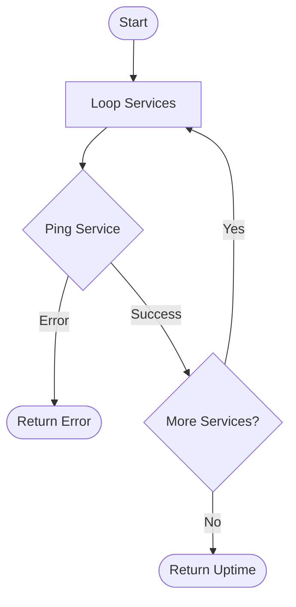

---
title: Healthcheck
---

# Healthcheck

The Healthcheck API provides a mechanism to monitor the operational status of the system and its core dependencies.

## Description

This endpoint is used by load balancers, container orchestrators, and monitoring services to determine if the application instance is healthy and capable of processing requests.

## Rules


- The endpoint must be accessed via a `GET` request.

## Request

- **Method:** `GET`
- **Path:** `/health`

- The system must perform a connectivity check on the primary database.
- The system must perform a connectivity check on the cache service.
- If any critical dependency is unreachable, the system must report an unhealthy status.

## Workflow

<MermaidZoom>

</MermaidZoom>

## Success Case

**Condition:** All internal components and dependencies are functioning correctly.

- **HTTP Status:** `200 OK`
- **Response Body:**
  ```json
  {
    "uptime": "1h30m",
    "status": true,
    "services": {
      "database": null,
      "cache": null,
      "broker": null,
      "storage": null
    }
  }
  ```

## Error Case

**Condition:** One or more critical components are unreachable or failing.

- **HTTP Status:** `503 Service Unavailable`
- **Response Body:**

  ```json
  {
    "uptime": "1h30m",
    "status": false,
    "services": {
      "database": "failed to connect",
      "cache": null,
      "broker": null,
      "storage": null
    }
  }
  ```
